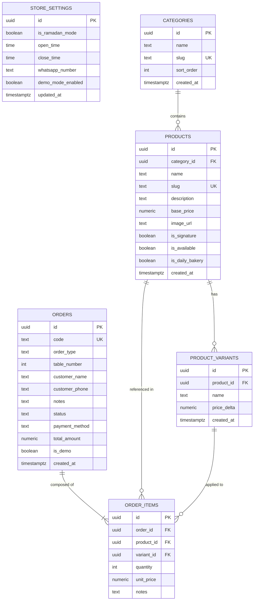
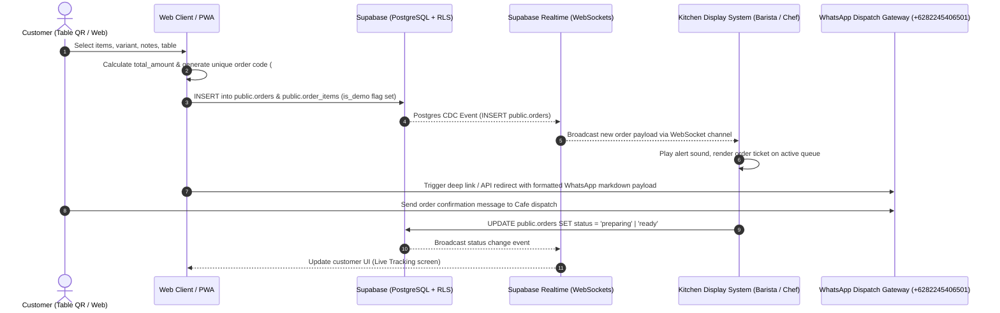

# Kaca Putih Cafe & Kitchen — System Architecture & Engineering Documentation

## 1. Brand Identity & Store Operational Profile

### Visual Brand Identity
- **Logo Archetype**: Monoline line-art emblem.
  - **Arch & Canopy**: Symmetrical arched wreath framing colonial-style awning house facade.
  - **Core Iconography**: Coffee cup centered with crossed fork and spoon.
  - **Typography**: Editorial serif header `"Kaca putih"` with sans-serif subtext `"CAFE & KITCHEN"`.
- **Location**: Malang, East Java, Indonesia.

### Operational Parameters
- **Operating Hours**:
  - **Standard Schedule**: `09:00 - 22:00 WIB`
  - **Ramadan Schedule**: `12:00 - 23:00 WIB` (Controlled via `store_settings.is_ramadan_mode`)
- **Dispatch WhatsApp**: `+6282245406501`
- **Fulfillment Modes**:
  1. `dine_in`: Table QR-code scanned order (`table_number` required).
  2. `takeaway`: Counter pickup order (`table_number` NULL).
- **Payment Methods**: `cash`, `qris`, `card` (Debit/Credit across Indonesian interbank networks - GPN, Visa, Mastercard).

---

## 2. Entity Relationship Diagram (Mermaid ERD)



---

## 3. Order Dispatch & Realtime Kitchen Display (KDS) Lifecycle



### WhatsApp Payload Specification
```text
*PESANAN BARU - KACA PUTIH CAFE & KITCHEN*
----------------------------------------
*Kode Pesanan:* #KP-1042
*Tipe:* DINE-IN (Meja 04)
*Nama:* Budi Santoso
*No. WhatsApp:* +6281234567890
*Metode Bayar:* QRIS

*Daftar Pesanan:*
- 1x Mont Blanc (Ice) - Rp 30.000
  _Catatan: Less ice_
- 1x Nasi Goreng Rendang - Rp 29.000
  _Catatan: Sedang_

*Total Pembayaran:* Rp 59.000
*Status:* Menunggu Konfirmasi Kitchen
----------------------------------------
_Mohon segera diproses. Terima kasih!_
```

---

## 4. Sandbox / Demo Mode Architecture

### Objective
Allow portfolio reviewers, testers, and recruiters to place simulated orders end-to-end without polluting real daily revenue, kitchen queues, or analytics metrics.

### Technical Implementation
1. **Database Isolation (`is_demo BOOLEAN`)**:
   - `public.orders` contains `is_demo BOOLEAN NOT NULL DEFAULT false`.
   - Test orders created from the demo URL or sandbox toggle automatically set `is_demo = true`.

2. **KDS Queue Filtering**:
   - Production KDS queries filter orders with `WHERE is_demo = false` during live kitchen operations.
   - A dedicated toggle on the KDS interface (`[All Orders | Live Only | Demo Sandbox]`) allows kitchen staff and reviewers to switch views.

3. **Analytics & Financial Reports**:
   - Aggregation queries exclude demo data:
     ```sql
     -- Daily Revenue Query
     SELECT 
         DATE_TRUNC('day', created_at) AS date,
         SUM(total_amount) AS live_revenue,
         COUNT(id) AS live_orders
     FROM public.orders
     WHERE status = 'completed' AND is_demo = false
     GROUP BY 1
     ORDER BY 1 DESC;
     ```

4. **Automated Cleanup**:
   - A lightweight cron or scheduled function purges demo orders older than 24 hours:
     ```sql
     DELETE FROM public.orders 
     WHERE is_demo = true 
       AND created_at < NOW() - INTERVAL '24 hours';
     ```

5. **WhatsApp Sandbox Safe-Guard**:
   - Demo orders prepend `[DEMO / TEST ORDER]` in the message body to prevent staff from preparing phantom orders.

---

## 5. Deployment & Execution Guide

### Supabase Migration Steps
1. Navigate to your Supabase Project Dashboard -> **SQL Editor**.
2. Run `schema.sql` to initialize tables, constraints, Realtime publication, and RLS policies.
3. Run `seed.sql` to populate initial categories, products, variants, and store settings from `MenuKacaputih.pdf`.
4. Verify Realtime is listening under **Database -> Publications -> supabase_realtime**.
